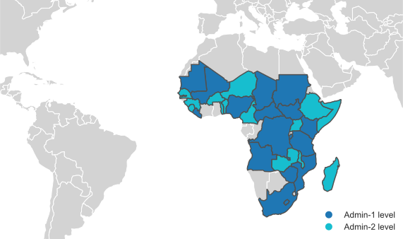

# Global Subnational Crop Data (GSCD)

Global Subnational Crop Data (GSCD)
The Global Subnational Crop Data (GSCD) is a repository that contains cleaned and harmonized subnational global crop production data from various sources, including the Famine [Early Warning Systems Network (FEWS NET)](https://fews.net/) of the United States Agency for International Development (USAID) and the Food and Agriculture Organization (FAO). 

This repository provides access to a comprehensive dataset that allows researchers, policymakers, and stakeholders to explore trends and patterns in crop production at the subnational level, enabling better-informed decisions related to food security, trade, and development. 

## Data Sources
The data in this repository is compiled from various sources, including:
- Famine Early Warning Systems Network (FEWS NET) of the United States Agency for International Development (USAID)
    - [FEWS NET Data Warehouse (FDW)](https://fews.net/data) (login required)
- Food and Agriculture Organization (FAO)
    - [FAO-STAT](https://www.fao.org/faostat/en/#home)
    - [Agro-MAPS](https://gaez.fao.org/pages/agromaps)
- National agricultural agencies

## Data Processing
The crop data in this repository is organized and calibrated using Python. The code used for processing the data is included in the repository.

## Repository Structure
This repository is organized as follows:

- `public/`: contains the processed data in CSV and JSON formats.
- `notebook/`: contains the Jupyter notebook used for processing the data per each country.
- `docs/`: contains any additional documentation related to the data.

## Current Data Status
GSCD currently contains subnational crop data for **`13`** countries (see [current data status per country](/docs/data_status_per_country.md)): 
- Admin-1 level: Afghanistan, Chad, Kenya, Lesotho, Liberia, Mali, South Africa, Yemen
- Admin-2 level: Burkina Faso, Malawi, Senegal, Somalia, Madagascar

## Contributors
- Dr. Donghoon Lee (UCSB)
- Dr. Weston Anderson (NASA)

## Contact 
Please contact to Donghoon Lee ([donghoonlee@ucsb.edu](donghoonlee@ucsb.edu)).

<!-- ## Usage
The data in this repository is available for free and unrestricted use. Users are encouraged to cite the sources of the data appropriately. The repository can be cloned or downloaded using the git command or the Github interface.

## Contributing
Contributions to this repository are welcome, including new data sources or improvements to the existing data. To contribute, please create a pull request with a clear description of the changes proposed.

## License
The data in this repository is licensed under the Creative Commons Attribution 4.0 International license (CC BY 4.0). -->