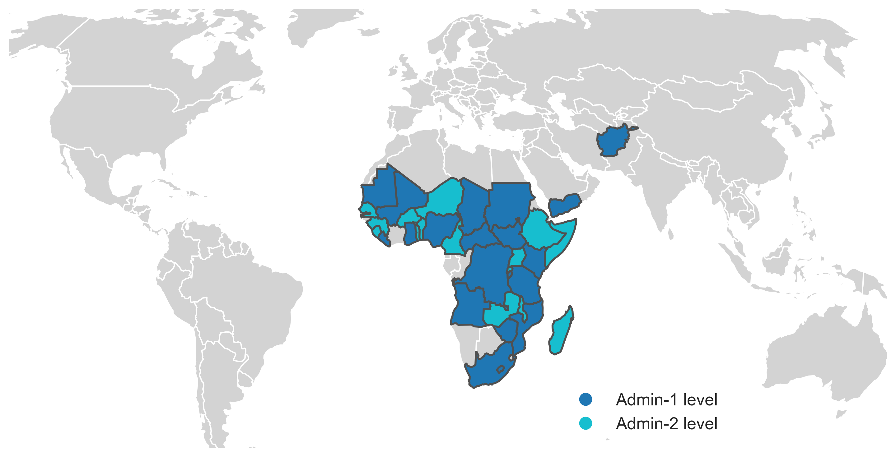

# HarvestStat - Harmonized Subnational Crop Statistics

The HarvestStat is a repository that contains cleaned and harmonized subnational global crop production data from various sources, including the Famine [Early Warning Systems Network (FEWS NET)](https://fews.net/) of the United States Agency for International Development (USAID) and the Food and Agriculture Organization (FAO). 

This repository provides access to a comprehensive crop dataset that allows researchers, policymakers, and stakeholders to explore trends and patterns from  the subnational to the global level, enabling better-informed decisions related to food security, trade, and development. 

## Data Sources
The data in this repository is compiled from various sources, including:
- Famine Early Warning Systems Network (FEWS NET) of the United States Agency for International Development (USAID). This is the primary source of information
    - [FEWS NET Data Warehouse (FDW)](https://fews.net/data) (login required)
- Food and Agriculture Organization (FAO)
    - [FAO-STAT](https://www.fao.org/faostat/en/#home)
- National agricultural agencies

## Data Processing and Sharing
We are currently sharing the Jupyter notebooks that we used to calibrate and harmonize the crop data for each country, which can be found in the `notebook/` directory. However, in order to keep the process streamlined, we do not share underlying data sources externally at this time. 

## Repository Structure
This repository is organized as follows:

- `docs/`: contains documentation related to the data.
- `notebook/`: contains the Jupyter notebook used for processing the data per each country.
- `public/`: contains the processed data in CSV and JSON formats. 
    - Note: the data is currently experimental and only available to internal research team.

## Current Data Status
HarvetStat currently contains subnational crop statistics for **`35`** countries.
<!-- (see [current data status per country](/docs/data_status_per_country.md)):  -->
- Admin-1 level: Afghanistan, Angola, Burundi, Central African Republic, Chad, DRC, Ghana, Kenya, Lesotho, Liberia, Mali, Mauritania, Mozambique, Nigeria, South Africa, South Sudan, Sudan, Tanzania, Yemen, Zimbabwe
- Admin-2 level: Benin, Burkina Faso, Cameroon, Ethiopia, Guinea, Madagascar, Malawi, Niger, Rwanda, Senegal, Sierra Leone, Somalia, Togo, Uganda, Zambia

## Contributors
- Dr. Donghoon Lee (University of Manitoba)
- Dr. Weston Anderson (UMD, NASA)
- Xuan Chen (IFPRI)

## Contact 
- Please contact Donghoon Lee ([Donghoon.Lee@umanitoba.ca](Donghoon.Lee@umanitoba.ca) and Weston Anderson [Weston@umd.edu](Weston@umd.edu)) for any questions or collaborations. 
- Users are welcome to open an [issue](https://github.com/chc-ucsb/gscd/issues).

<!-- ## Usage
The data in this repository is available for free and unrestricted use. Users are encouraged to cite the sources of the data appropriately. The repository can be cloned or downloaded using the git command or the Github interface.

## Contributing
Contributions to this repository are welcome, including new data sources or improvements to the existing data. To contribute, please create a pull request with a clear description of the changes proposed.

## License
The data in this repository is licensed under the Creative Commons Attribution 4.0 International license (CC BY 4.0). -->
